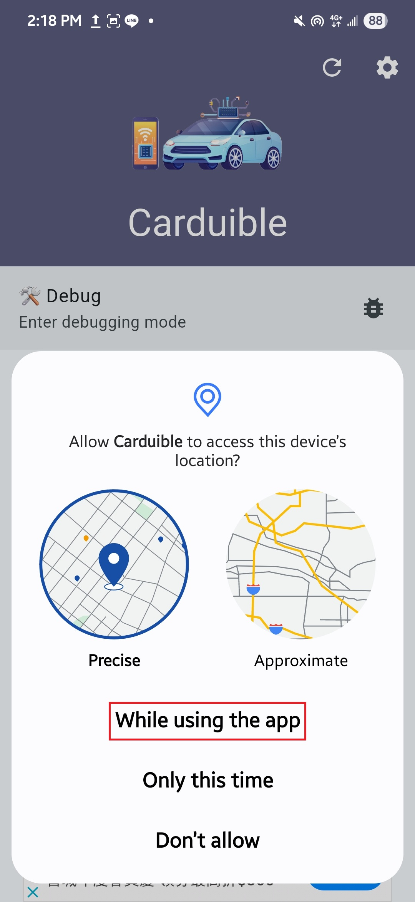
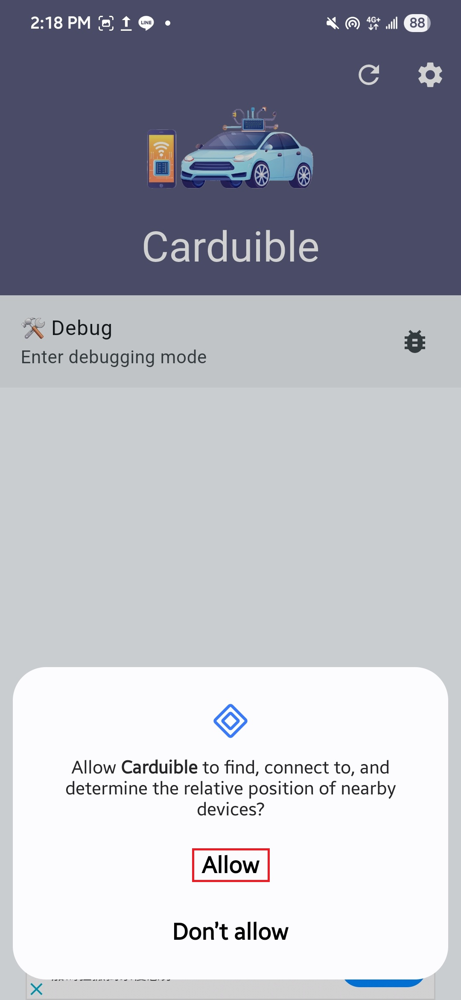
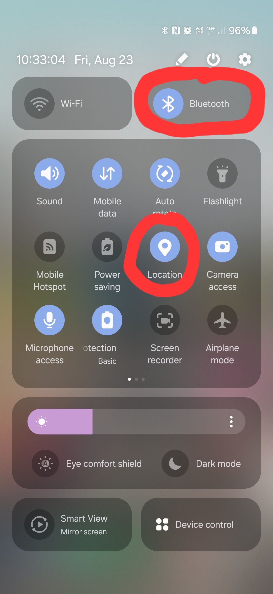
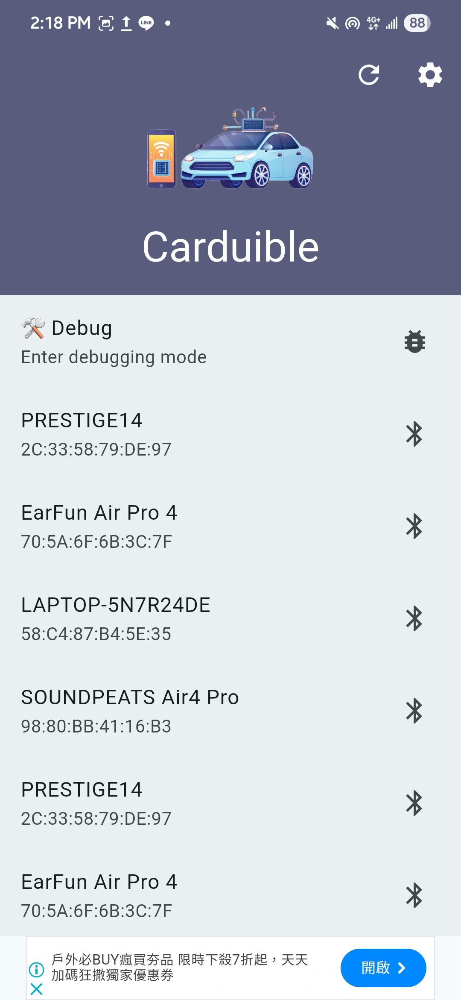

# Carduible

**Carduible** is a mobile application designed for controlling Arduino-based cars via Bluetooth Low Energy (BLE). Built using Flutter, this app offers a streamlined interface for connecting and controlling your car with ease.

## Download

* **Google Play:**
  [Download on Google Play](https://play.google.com/store/apps/details?id=com.liuutin9.arduino_car_bluetooth_controller_ble)

* **APK:**
  [Download APK](https://github.com/liuutin9/Carduible/releases/tag/v1.1.9)

## System Requirements

* **Supported Android Version:** Android 11 or higher

## Compatible Hardware

* **Microcontroller:** Arduino Uno
* **Bluetooth Module:** BT05 (BLE)

## Built With

* **Flutter Package:** [`flutter_blue_plus`](https://pub.dev/packages/flutter_blue_plus)

## Required Permissions

To function properly, the app requires the following permissions:

* **Location access** – Required for BLE scanning
* **Nearby devices** – Required to detect and connect to Bluetooth devices

## Getting Started

### 1. Grant Required Permissions

Ensure that the app has access to the necessary permissions:

<div align="center">
    
    
</div>

### 2. Enable Bluetooth and Location Services

Make sure both Bluetooth and location services are turned on:

<div align="center">
    
</div>

### 3. Connect to Your Bluetooth Device

Select your BT05 device from the list to initiate the connection:

<div align="center">
    
</div>

## Button Layout

Here is the button layout:
```
[Button 1] [Button 2] [Button 3] 
[Button 4] [Button 5] [Button 6] 
[Button 7] [Button 8] [Button 9]
```

Corresponding transmitted character:
```
['q'] ['w'] ['e'] 
['a'] ['x'] ['d'] 
['z'] ['s'] ['c'] 
```

**Note: Default transmitted character is `'0'`**