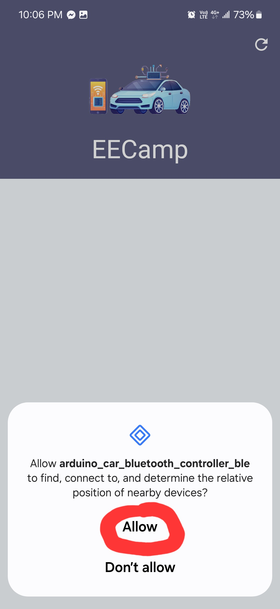
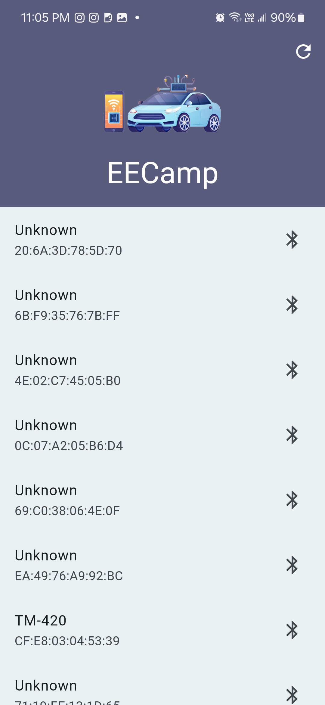

# arduino_car_bluetooth_controller_ble
It is a remote controller of an Arduino car with a BLE board.

## Download
Google Play Closed Test: https://play.google.com/store/apps/details?id=com.liuutin9.arduino_car_bluetooth_controller_ble  
APK: https://liuutin9.github.io/Shared-Files/eecamp.apk

## Supported System
Android 11+

## Boards
- Arduino Board: Arduino Uno
- Bluetooth Board: BT05

## Flutter Package
- flutter_blue_plus

## Permission Requirement
- Location
- Nearby devices

## How to use?
### Step 1: Allow the Permissions

### Step 2: Enable Bluetooth and location services

### Step 3: Choose your device to connect
